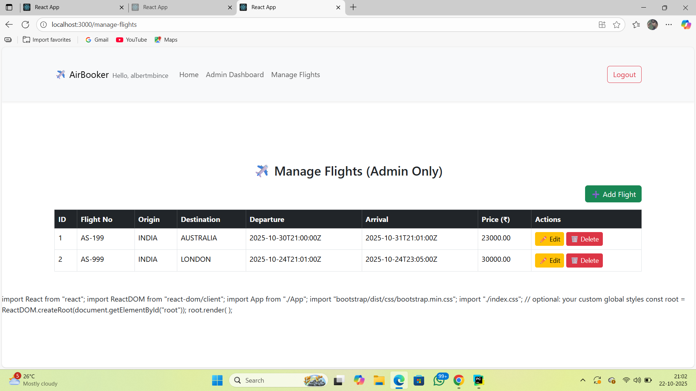

FlightBook

FlightBook is a full-stack flight booking platform with React as the frontend and Django REST Framework as the backend. The platform allows users to search and book flights, view their bookings, and cancel them. Admins can manage flights and approve or reject new users.

Features
For Users:
Register and log in.

Search for flights based on origin and destination.

Book flights and view all your bookings.

Cancel booked flights.

For Admins:

Manage flights (add, edit, delete).

Approve or reject new user registrations.

View all users.

Tech Stack

Frontend: React, Bootstrap

Backend: Django, Django REST Framework, Simple JWT

Database: SQLite (default for Django)

Authentication: JWT (JSON Web Tokens)

Project Setup
Backend (Django)

Clone the repository

git clone <your-repo-url>
cd flightbook-backend

Create a virtual environment

python -m venv venv
source venv/bin/activate   # Linux/Mac
venv\Scripts\activate      # Windows

Install dependencies

pip install -r requirements.txt

Apply migrations

python manage.py makemigrations
python manage.py migrate

Create a superuser

python manage.py createsuperuser

Run the server

python manage.py runserver

The backend will be available at: http://127.0.0.1:8000/

Frontend (React)

Navigate to frontend folder

cd flightbook-frontend

Install dependencies

npm install

Start the frontend

npm start

The frontend will be available at: http://localhost:3000/

Usage

Admin

Log in using your superuser credentials.

Go to Manage Flights to add, edit, or delete flights.

Approve or reject user registrations.

User

Register a new account and log in.

Search for flights.

Book flights and view or cancel your bookings.

Screenshots

Homepage:

Manage Flights (Admin):

Booking Flights (User):

Notes

Make sure to use a superuser/admin account to add flights.

User authentication is handled using JWT tokens; tokens are stored in localStorage.
##screenshots

